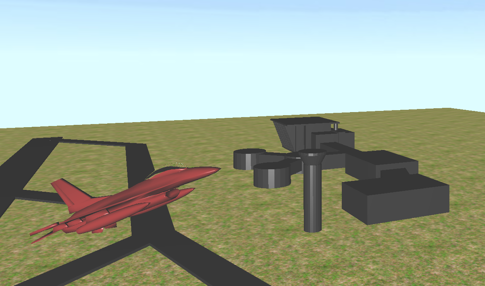

# Flight Simulator

This is a Flight Simulator project implemented in OpenGL as part of a CENG469 Computer Graphics course assignment. The goal of the assignment was to implement environment mapping and reflection capabilities using cubemaps. The project was implemented in C++ and OpenGL. 


<p align="center">
 <i>Flight Simulator </i>
</p>


## Project Structure
The codebase follows a mini-game engine design, with separate classes for different functionalities:

- `Camera.h`: This class helps to control the view of the scene and manage the camera movement.
- `Mesh.h`: This class is responsible for storing mesh data in buffers and handling mesh-related operations.
- `Shader.h`: This class creates shaders, sends uniform data to the corresponding shaders, and manages the rendering pipeline.
- `Renderer.h`: This class binds the buffers as shader attributes, renders objects using index buffers, and loads textures.
- `UAV.h`: This class handles the flight mechanisms and calculations for the airplane.
- `SkyBox.h`: This class handles the skybox calculations and rendering.

<br>

<video src="assets/8a883291edbab9ea.mp4" controls title="Flight Movement"></video>

<p align="center">
 <i>Flight Movement
 </i>
</p>

## Getting Started

### Prerequisites

- OpenGL 3.3 or later.
- C++ compiler supporting C++11 or later.
- The project has been tested on Linux platform.

### Installation

1. Clone the repository:
```
https://github.com/ramazantokay/Flight-Simulator.git
```

2. Change into the project directory:
```
cd Flight-Simulator
```

3. Build the project using the provided makefile:

```
make all
```

### Usage

1. Run the executable:

```
./main 
```

2. Use the controls to manipulate the rendered surfaces. 

The keyboard controls are as follows:
  * <kbd>W</kbd> Speed up
  * <kbd>S</kbd> Slow down
  * <kbd>A</kbd> Rool left
  * <kbd>D</kbd> Roll right
  * <kbd>Q</kbd> Change camera view to Left
  * <kbd>E</kbd> Change camera view to Right
  * <kbd>R</kbd> Change camera view to Back
  * <kbd>T</kbd> Change camera view to Front
  
<br>

<video src="assets/9c33d46f49191f57.mp4" controls title="Final gameplay video"></video>
<p align="center">
 <i>Final gameplay video
 </i>
</p>

## TODO List
- The dynamic reflection of the skybox has some issue, will be fixed
- The flight mechanism is not perfect, will be improved

<br>

## Disclaimer
Please note that this implementation may contain limitations, potential bugs, and dependencies on external libraries and tools. While efforts have been made to ensure correctness, there is no guarantee of flawless execution. Exercise caution, conduct thorough testing, and adapt the code to your requirements. Report issues on GitHub and contribute to improvements. Use responsibly, validate results, and the authors disclaim liability for any damages or issues arising from the use of this code.

## License
This project is licensed under the MIT License - see the LICENSE file for details.

## Contributing

Contributions are welcome! If you have any suggestions or improvements, feel free to submit a pull request or open an issue in the GitHub repository.

## Contact

If you have any questions, suggestions, or feedback, please feel free to reach out to me at [rmzntokay@gmail.com](mailto:rmzntokay@gmail.com).
